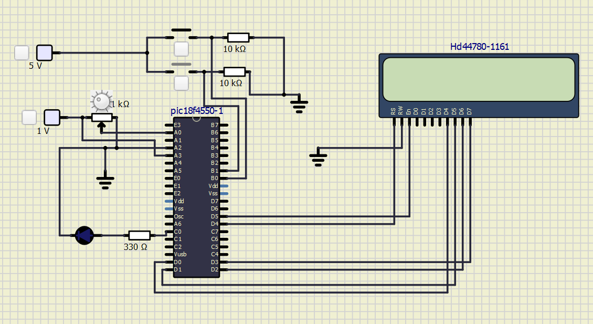

# Aferidor de Temperatura de Forno Industrial (PIC18F4550)

**Disciplina:** SEL0433 - Aplicação de Microprocessadores

**Autores:**
* Felipe Bressanin Maitan - 13748652
* Eduardo Gondim Rezende - 15448693
* Matheus Herberts Rios de Lima - 15653174

---

## Sobre o Projeto

Este projeto consiste no desenvolvimento de um firmware em **C para o
microcontrolador PIC18F4550**, compilado no **MikroC PRO for PIC** e
simulado no **SimulIDE**, com base no pinout do Kit EasyPIC v7. O
trabalho resolve uma situação-problema teórica de uma indústria
metalúrgica: aferir a temperatura interna de um forno industrial
durante um intervalo de tempo configurável pelo operador.

A temperatura é lida por um sensor **LM35** (emulado por um
potenciômetro no simulador) e exibida continuamente em um **display
LCD 16x2**. O tempo de aferição é selecionado por botões — uma
contagem regressiva de **longa duração (60 s)** ou **curta duração
(10 s)** — e um **LED** indica quando a temperatura ultrapassa 50 °C.

O desenvolvimento foi dividido em três entregas evolutivas
(**checkpoints**), cada uma introduzindo um recurso novo do PIC18,
culminando na entrega final que integra tudo.

---

## Estrutura do repositório

Todos os arquivos estão na raiz do repositório:

- `checkpoint1.c` — Checkpoint 1: LCD + debounce por software
- `checkpoint2.c` — Checkpoint 2: Timers0/1 + interrupções externas
- `projeto2_final.c` — Entrega final: ADC, LED e ajustes de estabilidade
- `esquematico_final.png` — esquemático do circuito (PIC, botões, LCD, LED, potenciômetro)

---

## Hardware utilizado (entrega final)

| Componente          | Pino PIC18F4550 | Observação |
|----------------------|------------------|------------|
| LCD RS               | RD4              | |
| LCD EN               | RD5              | |
| LCD D4–D7            | RD0–RD3          | modo 4 bits |
| LCD RW                | GND              | fixo em escrita |
| Botão (contagem longa)| RB0 / INT0       | borda de subida, pull-down |
| Botão (contagem curta)| RB1 / INT1       | borda de subida, pull-down |
| Potenciômetro (LM35)  | AN0 (RA0)        | wiper no pino; extremos ligados na fonte de 1V e no GND |
| Fonte de 1V            | AN3 (RA3) **e** topo do potenciômetro | mesma fonte alimenta os dois, com fios independentes |
| Vref- (GND)            | AN2 (RA2)        | fio direto pro GND, independente do potenciômetro |
| LED indicador          | RC0              | resistor de 330 Ω, catodo no GND |

Clock do sistema: **8 MHz**, configurado via propriedade do componente
PIC no SimulIDE (sem cristal externo no esquemático).

---

## Checkpoint 1 — LCD e tratamento de bouncing

**Objetivo:** introduzir o acionamento de um display LCD em modo 4
bits e o tratamento do efeito *bouncing* em um botão mecânico.

**O que foi desenvolvido:**
- LCD inicializado em modo 4 bits, conectado nos pinos do `PORTB`
  (RB0–RB5), e o texto fixo "HelloWrld" escrito na linha 1.
- Um botão em `RD0` incrementa um contador de 0 a 9 exibido na linha
  2, com `switch-case` convertendo o valor numérico para o caractere
  correspondente.
- O efeito *bouncing* é tratado por software: ao detectar o botão
  pressionado (borda de subida), o programa aguarda 20 ms e
  **confirma** se o nível lógico ainda está em 1 antes de validar o
  aperto. Uma flag auxiliar (`botao_ja_contado`) garante que um único
  aperto não seja contado múltiplas veze, ela só é liberada quando o
  botão é solto (`botao == 0`).

Arquivo: [`checkpoint1.c`](checkpoint1.c)

---

## Checkpoint 2 — Timers e interrupções

**Objetivo:** substituir a leitura por polling do checkpoint 1 por um
controle baseado em **interrupções externas** e **temporizadores**,
recursos mais robustos do PIC18 em relação ao 8051.

**O que foi desenvolvido:**
- LCD migrado para o `PORTD`, liberando o `PORTB` para os botões com
  interrupção.
- **Botão 1 (RB0/INT0):** inicia uma contagem regressiva de 60 s,
  usando o **Timer0** (16 bits, prescaler 1:128) recarregado com
  `0xC2F7` para gerar uma base de tempo de ~1 segundo por estouro.
- **Botão 2 (RB1/INT1):** inicia uma contagem regressiva de 10 s,
  usando o **Timer1** (16 bits, prescaler 1:8) recarregado com
  `0x0BDC`, gerando uma base de ~250 ms; a cada 4 estouros (1 s), o
  segundo é decrementado.
- Ambos os botões disparam interrupções por **borda de subida**
  (`INTCON2.INTEDG0/1 = 1`).
- A atualização do LCD não ocorre dentro da interrupção: a ISR apenas
  decrementa os contadores e seta uma flag (`pede_lcd`), que o laço
  principal usa para decidir quando redesenhar a tela. Isso mantém a
  ISR curta e evita travar o tempo de resposta às interrupções.

Arquivo: [`checkpoint2.c`](checkpoint2.c)

---

## Entrega final — Leitura de temperatura via ADC

**Objetivo:** integrar a leitura analógica de temperatura (LM35 /
potenciômetro) e um indicador de LED ao código do checkpoint 2.

**O que foi desenvolvido:**
- Leitura do canal **AN0** via `ADC_Get_Sample()`, convertendo o valor
  bruto (0–1023) para temperatura em **graus Celsius com uma casa
  decimal, sem usar `float`**: a conversão é feita em escala ×10
  (`leitura * 1000 / 1023`), preservando a precisão da casa decimal
  até o último momento, quando os dígitos são separados por divisão e
  resto inteiros para exibição no formato `XX.X °C`.
- **LED em RC0** acende sempre que a temperatura ultrapassa 50.0 °C
  (comparação feita também em escala ×10, contra `500`, para não
  perder precisão).
- A leitura de temperatura e a atualização do LED ocorrem
  continuamente **durante a contagem regressiva** (longa ou curta), no
  laço principal, junto com a atualização dos segundos restantes.

Arquivo: [`projeto2_final.c`](projeto2_final.c)

---

## Como simular

1. Abrir o `.c` correspondente no **MikroC PRO for PIC**, device
   `P18F4550`, clock `8 MHz`.
2. Na aba **Library Manager**, habilitar as bibliotecas `Lcd` e `ADC`
   (necessário para `Lcd_Out`/`Lcd_Chr`/`ADC_Get_Sample` serem
   reconhecidos pelo compilador).
3. Compilar (`Ctrl+F9`) para gerar o `.hex`.
4. No **SimulIDE**, montar o circuito conforme a tabela de hardware
   acima, carregar o `.hex` no componente do PIC (botão direito →
   *Load Firmware*) e iniciar a simulação. Lembre-se de colocar o clock do PIC em 8MHz.
5. Para conferir registradores internos (como `ADCON1` ou `LATC`)
   durante a simulação, clicar com o botão direito sobre o
   microcontrolador → **Open MCU Monitor**.

## Vídeo de demonstração

[Aferidor de Temperatura de Forno Industrial (PIC18F4550)](https://youtu.be/LobFtIF55QE)
